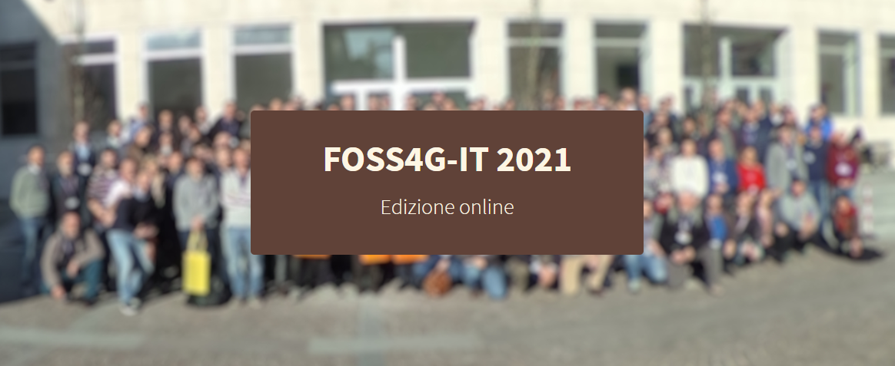
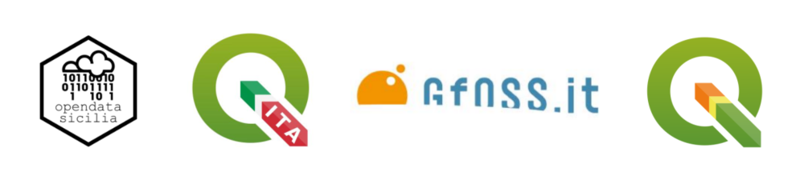

# Workshop FOSS4G-IT 2021

in progress...

Workshop al **FOSS4G-IT-2021**: Alla scoperta delle espressioni di **QGIS**: come e dove usarle.

---

**INDICE**

<!-- TOC -->

- [Workshop FOSS4G-IT 2021](#workshop-foss4g-it-2021)
  - [Relatore](#relatore)
  - [Data, luogo e durata](#data-luogo-e-durata)
  - [Piattaforme e Software](#piattaforme-e-software)
- [Programma](#programma)
  - [Lo sapevi che](#lo-sapevi-che)
  - [QGIS e le espressioni ESEMPI](#qgis-e-le-espressioni-esempi)
- [Contatti](#contatti)
  - [Salvatore Fiandaca](#salvatore-fiandaca)
  - [Sitografia](#sitografia)
- [Riferimenti utili](#riferimenti-utili)
- [Cosa c'è in questo repo](#cosa-cè-in-questo-repo)
- [risultati](#risultati)

<!-- /TOC -->

---

**TITOLO**:   Alla scoperta delle espressioni di [QGIS](https://qgis.org/it/site/): come e dove usarle.

**DESCRIZIONE**:   Obiettivo di questo GeoBreak è quello di evidenziare le potenzialità delle espressioni di **QGIS**: come usarle, dove usarle e perché non possiamo fare a meno del Field Calc di QGIS.

---

## Relatore

- **Salvatore FIANDACA** (aka Totò, pigreco)  (Membro [OpenDataSicilia](http://opendatasicilia.it/) (2014) | Membro [QGIS Italia](http://qgis.it/) (2015) | Socio [GFOSS.it](https://gfoss.it/) (2017) | Membro [QGIS organization](https://github.com/qgis) (2020) | Ideatore della Guida [#HfcQGIS](http://hfcqgis.opendatasicilia.it/it/latest/) (2018))

## Data, luogo e durata

- 🗓 20/09/2021 con orario  🕟 10.00 🕢 12.00 
- 🌐 on-line
- ⏳ due ore

## Piattaforme e Software

- [ZOOM]() - per diretta web
- Windows 10 64b - come SO
- [`QGIS 3.16 LTR Hannover o superiori`](https://qgis.org/it/site/)

# Programma

## Lo sapevi che

non puoi fare a meno delle espressioni di QGIS?

1. Le espressioni di QGIS:
   1. linguaggio misto;
   2. funzionano solo all'interno di QGIS;
2. dove posso utilizzarle:
   1. tabella degli attributi;
   2. tematizzazione;
   3. etichettatura;
   4. selezione;
   5. compositore di stampe, atlas e report;
   6. strumenti di processing;
   7. moduli inserimento dati e widget;
   8. azioni;
   9. modellatore grafico;
   10. diagrammi;
   11. filtri;
   12. decorazioni;
   13. proprietà layer: variabili;
   14. statistiche;
   15. suggerimenti mappa;
   16. ecc...
3. guida in linea:
   1. la guida e come richiamarla;
   2. l'importanza delle definizioni delle funzioni;
   3. [HfcQGIS v2](http://hfcqgis.opendatasicilia.it/it/latest/) (nuova versione)
4. gui e sintassi:
   1. la gui: area editor, area gruppi e area help in linea;
   2. come funziona la sintassi;
   3. paramentri denominati;
   4. funzioni senza argomenti;
5. come posso utilizzarle:
   1. semplici funzioni;
   2. semplici espressioni;
   3. complesse espressioni;
   4. richiamare altri layer;
   5. creare nuovi campi;
   6. aggiornare campi esistenti;
   7. creare campi virtuali;
6. primi esempi:
   1. semplice calcolatrice;
   2. funzioni semplici $area, $perimeter
   3. generatore di geometrie (stile e label);
   4. generare geometrie tramite espressioni (processing).

[↑ torna su ↑](#workshop_foss4g-it-2021)

## QGIS e le espressioni ESEMPI

Le espressioni di QGIS permettono di velocizzare il lavoro in QGIS

- [slide](https://docs.google.com/presentation/d/e/2PACX-1vS7sCUuKDkBP5GfQZhaDCAzi9bKmFZyPsgIdJhp7xd8hDUQizQqffuW9sCwcQe3lxAjyaHkaQYP8H9e/pub?start=false&loop=false&delayms=3000)
- dati

[↑ torna su ↑](#workshop_foss4g-it-2021)

# Contatti

## Salvatore Fiandaca

* **Mail**: <pigrecoinfinito@gmail.com>
* **Facebook**: <https://www.facebook.com/pigreco314>
* **Twitter**: <https://twitter.com/totofiandaca>

## Sitografia

* **blog**: <https://pigrecoinfinito.com/>
* **canale youtube**: <http://www.youtube.com/c/TotòFiandaca>
* **HfcQGIS**: <https://hfcqgis.opendatasicilia.it/>
* **Tansignari**: <http://tansignari.opendatasicilia.it/it/latest/#>
* **data.world**: <https://data.world/pigrecoinfinito>
* **github**: <https://github.com/pigreco>
* **gitlab**: <https://gitlab.com/pigr3co>
* **Canale Telegram** : <https://t.me/pigrecoinfinito>

[↑ torna su ↑](#workshop_foss4g-it-2021)

# Riferimenti utili

- **FOSS4G-IT 2021** : <https://foss4g-it2021.gfoss.it/index.html>
- **QGIS** : <https://qgis.org/it/site/>
- **Repo QGIS** : <https://github.com/qgis/QGIS/blob/master/README.md>
- **Font Trueno** : <https://www.wfonts.com/font/trueno>
- **Visual Style Guide** : <https://www.qgis.org/en/site/getinvolved/styleguide.html#trueno-fonts>
- **Visual Studio Code** : <https://code.visualstudio.com/>
- **OpenDataSicilia** : <http://opendatasicilia.it/>

[↑ torna su ↑](#workshop_foss4g-it-2021)

# Cosa c'è in questo repo

- cartella `imgs` contiene le immagini utilizzate nel progetto .qgs;
- cartella `risorse` contiene i file utilizzati nel progetto, come:
- file `license` è il file che definisce la licenza del repository;
- file `README.md` è questo file, con le info.

[↑ torna su ↑](#workshop_foss4g-it-2021)

# risultati

