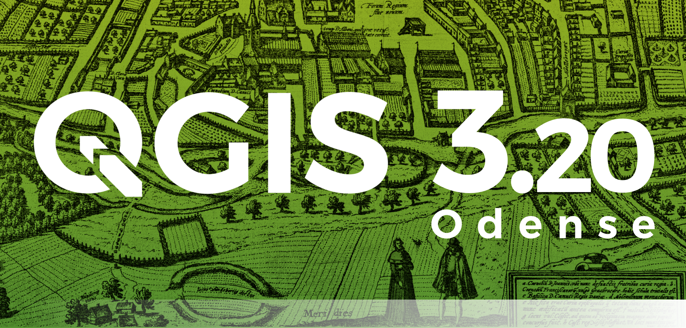
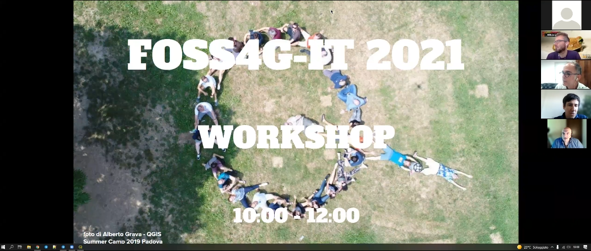
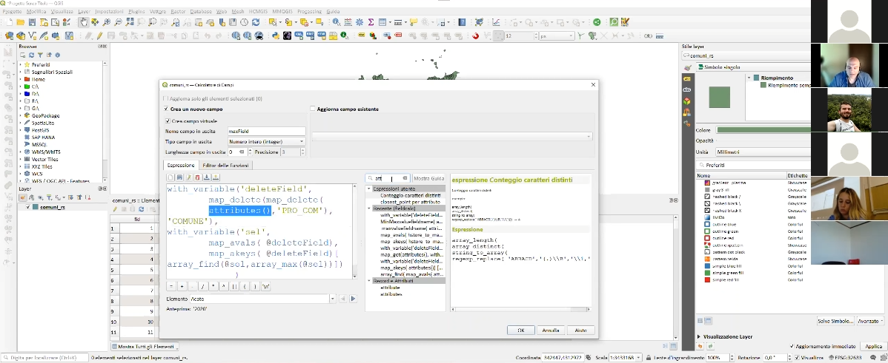
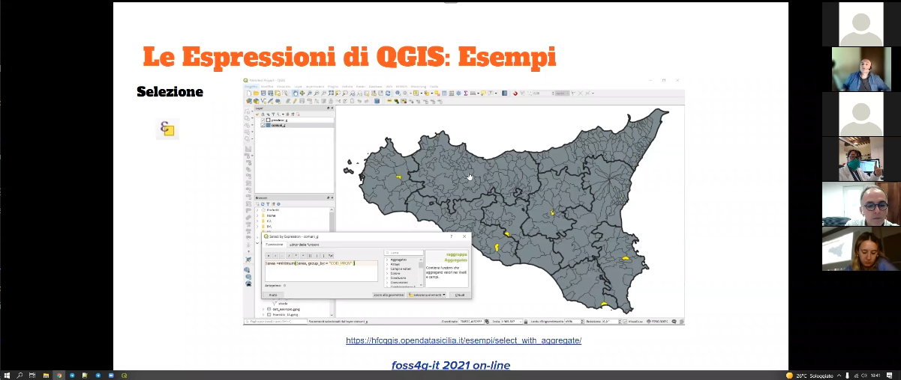

# Workshop FOSS4G-IT 2021

Workshop al **FOSS4G-IT-2021**: Alla scoperta delle espressioni di **QGIS**: come e dove usarle.

Per domande o semplicmente <br>per lasciare un pensiero clicca su PARTECIPA: <br>
[](https://github.com/pigreco/Workshop_FOSS4G-IT-2021/discussions)

---

**INDICE**

<!-- TOC -->

- [Workshop FOSS4G-IT 2021](#workshop-foss4g-it-2021)
  - [Relatore](#relatore)
  - [Data, luogo e durata](#data-luogo-e-durata)
  - [Piattaforme e Software](#piattaforme-e-software)
- [Programma](#programma)
  - [Lo sapevi che](#lo-sapevi-che)
  - [QGIS e le espressioni ESEMPI](#qgis-e-le-espressioni-esempi)
- [Contatti](#contatti)
  - [Salvatore Fiandaca](#salvatore-fiandaca)
  - [Sitografia](#sitografia)
- [Riferimenti utili](#riferimenti-utili)
- [Cosa c'è in questo repo](#cosa-cè-in-questo-repo)
- [LICENZA DATI](#licenza-dati)
- [risultati](#risultati)
  - [domande fatte](#domande-fatte)

<!-- /TOC -->

---

**TITOLO**: <br> Alla scoperta delle espressioni di [QGIS](https://qgis.org/it/site/): come e dove usarle.

**DESCRIZIONE**: <br> Obiettivo di questo GeoBreak è quello di evidenziare le potenzialità delle espressioni di **QGIS**: come usarle, dove usarle e perché non possiamo fare a meno del Field Calc di QGIS.

<p align="center"><a href="https://foss4g-it2021.gfoss.it/index.html" target="_blank"></a></p>

---

[](https://github.com/pigreco/seminario-estate-gis-2020/blob/master/license)
[](https://github.com/pigreco/seminario-estate-gis-2020/commits/master)

## Relatore

- **Salvatore FIANDACA** (aka Totò, pigreco) <br>(Membro [OpenDataSicilia](http://opendatasicilia.it/) (2014) | Membro [QGIS Italia](http://qgis.it/) (2015) | Socio [GFOSS.it](https://gfoss.it/) (2017) | Membro [QGIS organization](https://github.com/qgis) (2020) | Ideatore della Guida [#HfcQGIS](http://hfcqgis.opendatasicilia.it/it/latest/) (2018))

<p align="center"><a href="" target="_blank"></a></p>


## Data, luogo e durata

- 🗓 20/09/2021 con orario  🕟 10.00 🕢 12.00 
- 🌐 on-line
- ⏳ due ore

## Piattaforme e Software

- [ZOOM]() - per diretta web
- Windows 10 64b - come SO
- [`QGIS 3.16 LTR Hannover o superiori`](https://qgis.org/it/site/)

<p align="center"><a href="" target="_blank"></a></p>

# Programma

## Lo sapevi che

non puoi fare a meno delle espressioni di QGIS?

1. Le espressioni di QGIS:
   1. linguaggio misto;
   2. funzionano solo all'interno di QGIS;
2. dove posso utilizzarle:
   1. tabella degli attributi;
   2. tematizzazione;
   3. etichettatura;
   4. selezione;
   5. compositore di stampe, atlas e report;
   6. strumenti di processing;
   7. moduli inserimento dati e widget;
   8. azioni;
   9. modellatore grafico;
   10. diagrammi;
   11. filtri;
   12. decorazioni;
   13. proprietà layer: variabili;
   14. statistiche;
   15. suggerimenti mappa;
   16. ecc...
3. guida in linea:
   1. la guida e come richiamarla;
   2. l'importanza delle definizioni delle funzioni;
   3. [HfcQGIS v2](http://hfcqgis.opendatasicilia.it/it/latest/) (nuova versione)
4. gui e sintassi:
   1. la gui: area editor, area gruppi e area help in linea;
   2. come funziona la sintassi;
   3. paramentri denominati;
   4. funzioni senza argomenti;
5. come posso utilizzarle:
   1. semplici funzioni;
   2. semplici espressioni;
   3. complesse espressioni;
   4. richiamare altri layer;
   5. creare nuovi campi;
   6. aggiornare campi esistenti;
   7. creare campi virtuali;
6. primi esempi:
   1. semplice calcolatrice;
   2. funzioni semplici $area, $perimeter
   3. generatore di geometrie (stile e label);
   4. generare geometrie tramite espressioni (processing).

[↑ torna su ↑](#workshop-foss4g-it-2021)

## QGIS e le espressioni ESEMPI

Le espressioni di QGIS permettono di velocizzare il lavoro in QGIS

- [slide](https://docs.google.com/presentation/d/e/2PACX-1vS7sCUuKDkBP5GfQZhaDCAzi9bKmFZyPsgIdJhp7xd8hDUQizQqffuW9sCwcQe3lxAjyaHkaQYP8H9e/pub?start=false&loop=false&delayms=3000)
- [dati](https://github.com/pigreco/Workshop_FOSS4G-IT-2021/raw/main/vettori.zip)
- [esempi](esempi.md)

[↑ torna su ↑](#workshop_foss4g-it-2021)

# Contatti

## Salvatore Fiandaca

* **Mail**: <pigrecoinfinito@gmail.com>
* **Facebook**: <https://www.facebook.com/pigreco314>
* **Twitter**: <https://twitter.com/totofiandaca>

## Sitografia

* **blog**: <https://pigrecoinfinito.com/>
* **canale youtube**: <http://www.youtube.com/c/TotòFiandaca>
* **HfcQGIS**: <https://hfcqgis.opendatasicilia.it/>
* **Tansignari**: <http://tansignari.opendatasicilia.it/it/latest/#>
* **data.world**: <https://data.world/pigrecoinfinito>
* **github**: <https://github.com/pigreco>
* **gitlab**: <https://gitlab.com/pigr3co>
* **Canale Telegram** : <https://t.me/pigrecoinfinito>

[↑ torna su ↑](#workshop-foss4g-it-2021)

# Riferimenti utili

- **FOSS4G-IT 2021** : <https://foss4g-it2021.gfoss.it/index.html>
- **QGIS** : <https://qgis.org/it/site/>
- **Repo QGIS** : <https://github.com/qgis/QGIS/blob/master/README.md>
- **Font Trueno** : <https://www.wfonts.com/font/trueno>
- **Visual Style Guide** : <https://www.qgis.org/en/site/getinvolved/styleguide.html#trueno-fonts>
- **Visual Studio Code** : <https://code.visualstudio.com/>
- **OpenDataSicilia** : <http://opendatasicilia.it/>

[↑ torna su ↑](#workshop-foss4g-it-2021)

# Cosa c'è in questo repo

- cartella `imgs` contiene le immagini utilizzate nel progetto .qgs;
- cartella `risorse` contiene i file utilizzati nel progetto
- vettori.zip : limiti amministrativi ISTAT 2021;
- file `license` è il file che definisce la licenza del repository;
- file `README.md` è questo file, con le info.

[↑ torna su ↑](#workshop-foss4g-it-2021)

# LICENZA DATI

NB: Tutti i dati prodotti dall’Istituto nazionale di statistica (ISTAT) sono rilasciati sotto licenza [Creative Commons (CC BY 3.0 IT)](https://www.istat.it/it/note-legali): è possibile riprodurre, distribuire, trasmettere e adattare liberamente dati e analisi dell’Istituto nazionale di statistica, anche a scopi commerciali, a condizione che venga citata la fonte.

# risultati

- max 75 partecipanti

## domande fatte

```
Alessandro Capannelli:
   salve volevo chiedere per un caso specifico...un esempio di sovrapposizione di diversi piani urbanistici...chiedo se è possibile tramite formule creare un carotaggio dei dati dei piani urbanistici mediante selezione del perimentro catastale di una unità immobiliare per Foglio e numero di particella...
```

```
Andrea Ghersi:
	Ciao Totò e grazie per il sempre ottimo lavoro! Purtroppo i widget non sembrano funzionare con qgis per Mac (ho il 3.16 LTR) so che te ne avevo già accennato tempo fa, ma per caso hai delle novità sul perché di questo problema? Ti ringrazio!
```

```
Dario Zampini:
	Ciao, come si chiama il plug in per aggiungere i grafici nel layout di stampa?
```

```
Alessandro Albieri:
	A me è sfuggito prima come ha messo filtro su etichetta per mostrare solo poligono selezionato.
```

```
Andrea Ghersi:
	Totò per utilizzare gli array può essere molto utile usare il plugin “arrayPlus” o sbaglio?
```

```
Eleonora Mastroforti:
	Posso avere il link dove scaricare i dati di esempio dell'ultimo esempio? grazie
```

```
Riccardo Montalbano:
	grazie mille, utilissimo come al solito!
```

```
Francesco Fiermonte:
	A proposito della "mancanza di immagini" nell'help del calcolatore dei campi, non si potrebbe aggiungere - nella descrizione di ciascuna funzione, sempre che il rimando abbia senso - un link puntale al manuale / alla documentazione ufficiale (che, peraltro, e' fatta benissimo) in cui viene esplicitata una descrizione estesa? Forse aiuterebbe...
```

```
Andrea Fanelli:
	Ottimo, utilissimo.
```

```
Andrea Rosa:
	Grazie. Molto interessante e utile.
```

```
Dario Zampini:
	grazie mille, molto interessante.
```

```
Claudio Catucci:
	Grazie, ottimo workshop!
```

```
Alessandro Albieri:
	E' una funzione molto utile e l'ho usata per salvarmi espressioni personalizzate. Grazie. Workshop veramente molto utile. Saluti a tutti
```

```
Daniel_Borriello:
	E' stato tutto molto interessante! Grazie :)
```







