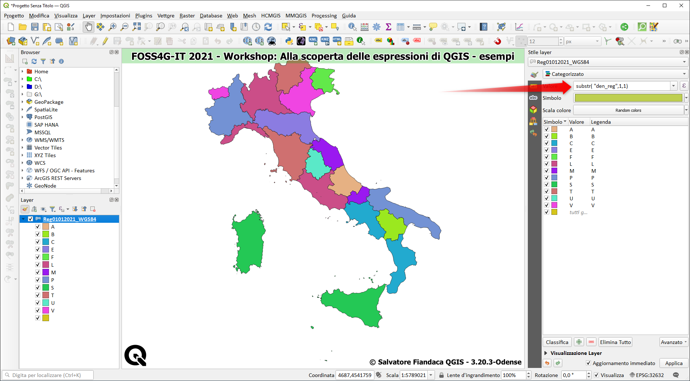
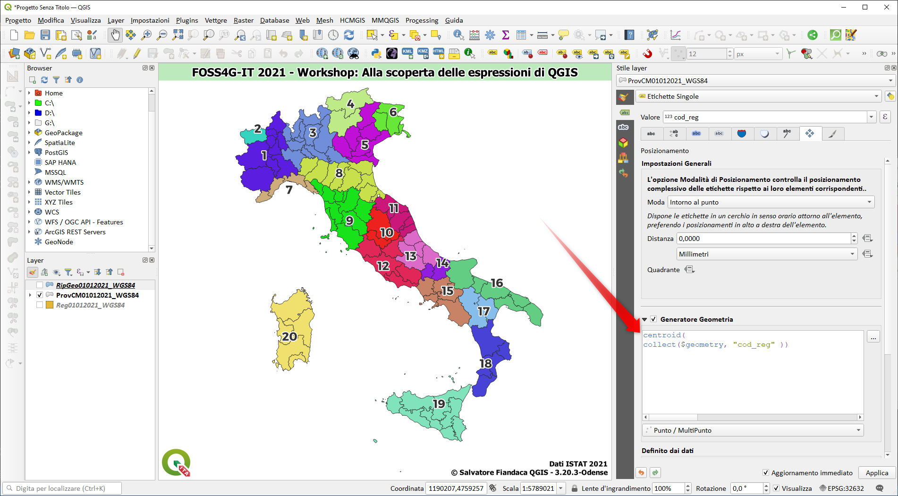
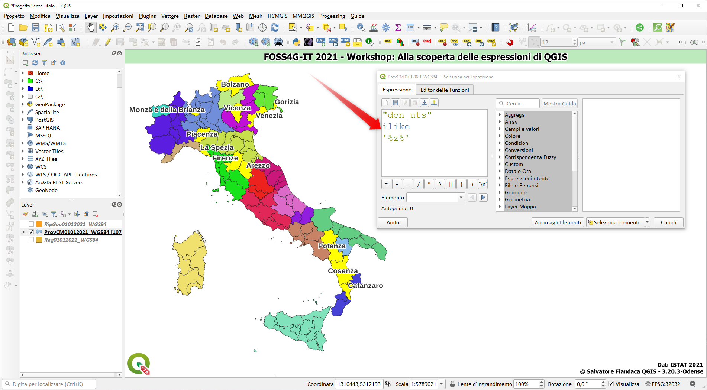
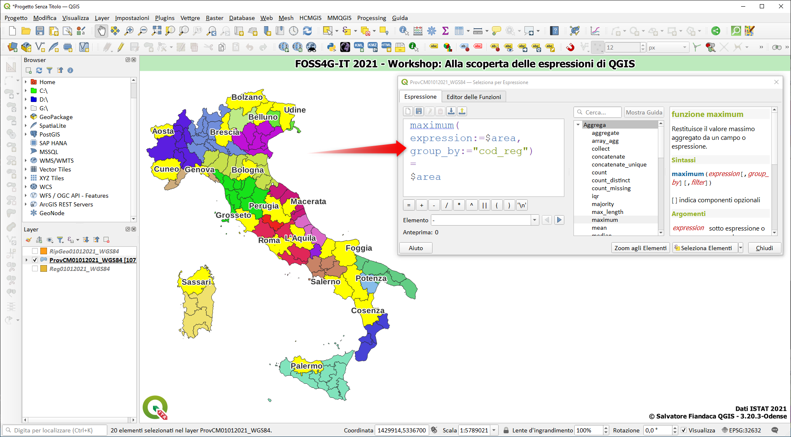
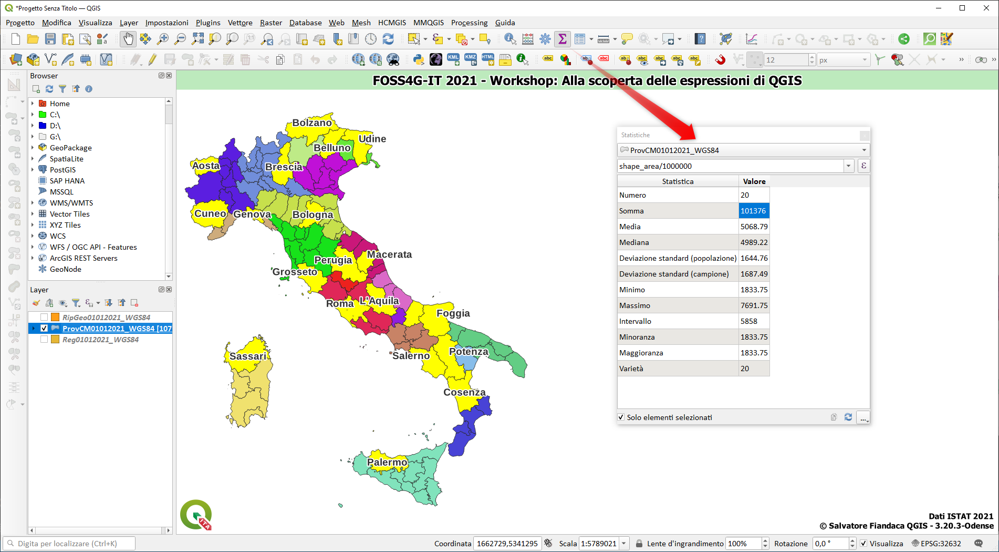
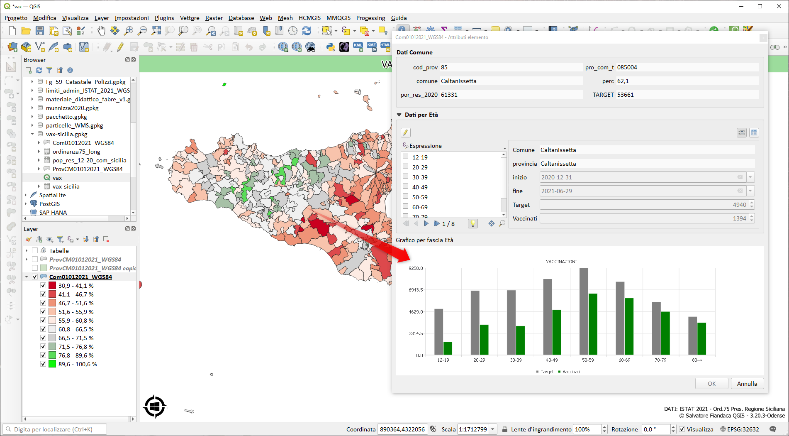
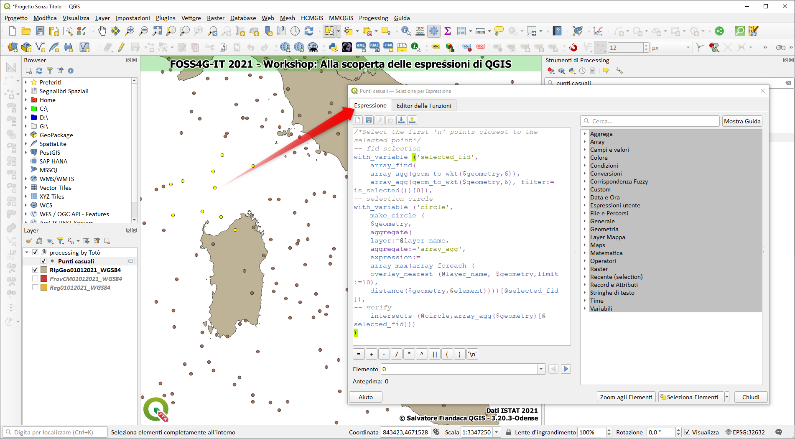
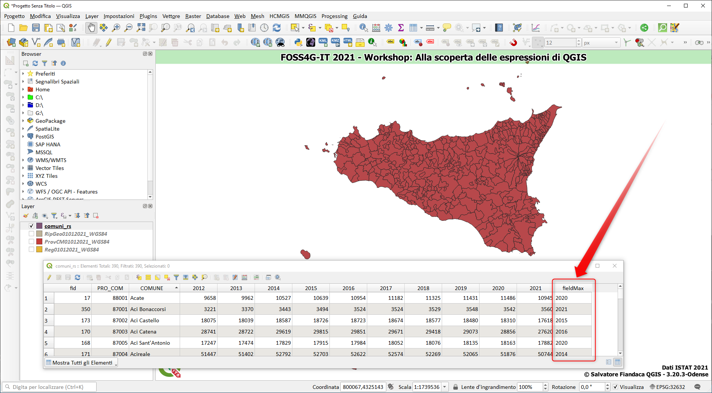
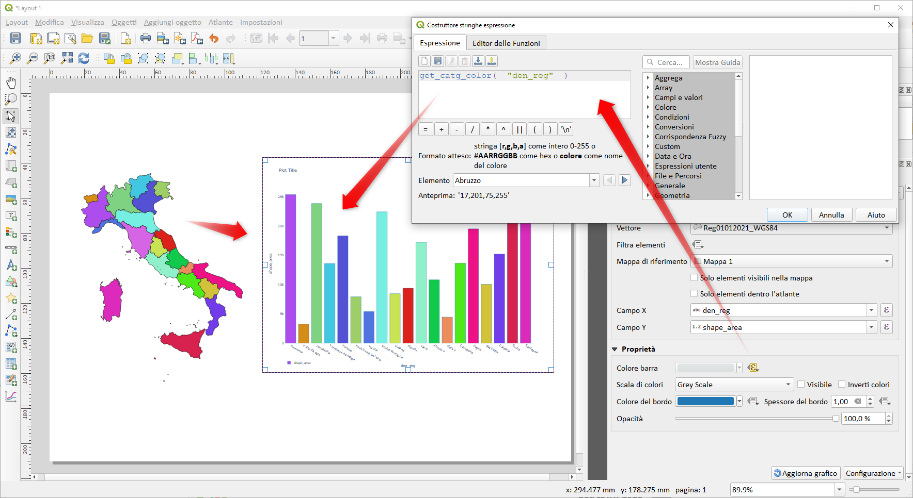

# Esempi

Sotto gli esempi proposti durante la parte pratica

<!-- TOC -->

- [Esempi](#esempi)
  - [Tematizzare usando le espressioni](#tematizzare-usando-le-espressioni)
    - [caso semplice](#caso-semplice)
  - [Etichettare usando le espressioni](#etichettare-usando-le-espressioni)
    - [caso semplice](#caso-semplice-1)
  - [Tabella degli attributi](#tabella-degli-attributi)
    - [vari casi](#vari-casi)
  - [Selezione per espressione](#selezione-per-espressione)
    - [attributi alfanumerici](#attributi-alfanumerici)
    - [geometria](#geometria)
  - [Statistiche](#statistiche)
  - [Widget](#widget)
  - [Gruppo Funzioni Array](#gruppo-funzioni-array)
  - [Gruppo Funzioni Maps](#gruppo-funzioni-maps)
  - [Compositore di stampe e grafico a colori](#compositore-di-stampe-e-grafico-a-colori)
- [RIFERIMENTI](#riferimenti)

<!-- /TOC -->

## Tematizzare usando le espressioni

### caso semplice

espressione

```
substr( "den_reg",1,1)
```



↑ [TORNA SU](#esempi) ↑

## Etichettare usando le espressioni

### caso semplice

```
centroid(
collect($geometry, "cod_reg" ))
```



↑ [TORNA SU](#esempi) ↑

## Tabella degli attributi

### vari casi

```
UPPER("COD_REG")
```

↑ [TORNA SU](#esempi) ↑

## Selezione per espressione

### attributi alfanumerici

```
"den_uts"
ilike
'%z%'
```



↑ [TORNA SU](#esempi) ↑

### geometria

```
 maximum(
 expression:=$area,
 group_by:="cod_reg")
 =
 $area
 ```



↑ [TORNA SU](#esempi) ↑

## Statistiche



## Widget



[blog post](https://pigrecoinfinito.com/2021/07/15/dati-sulla-vaccinazione-in-sicilia/)

↑ [TORNA SU](#esempi) ↑

## Gruppo Funzioni Array

Selezionare i primi 10 punti più vicini al punto selezionato



[54esimo esempio #HfcQGIS](https://hfcqgis.opendatasicilia.it/esempi/selezionare_punti_vicini_punto/)

↑ [TORNA SU](#esempi) ↑

## Gruppo Funzioni Maps

Determinare il nome del campo che contiene il valore più grande

```
with_variable('deleteField',
        map_delete(map_delete(map_delete(
        attributes(),'fid'),'PRO_COM'),'COMUNE'),
with_variable('sel',
        map_avals( @deleteField),
        map_akeys( @deleteField)[array_find(@sel,array_max(@sel))])
             )
```



[55esimo esempio #HfcQGIS](https://hfcqgis.opendatasicilia.it/esempi/maxValoreCampoNome/)

↑ [TORNA SU](#esempi) ↑

## Compositore di stampe e grafico a colori

funzione personalizzata

[get_catg_color](https://hfcqgis.opendatasicilia.it/gr_funzioni/custom/custom_unico/#get_catg_color)



↑ [TORNA SU](#esempi) ↑

# RIFERIMENTI

- [HfcQGIS](https://hfcqgis.opendatasicilia.it/)
- [QGIS](https://www.qgis.org/it/site/)